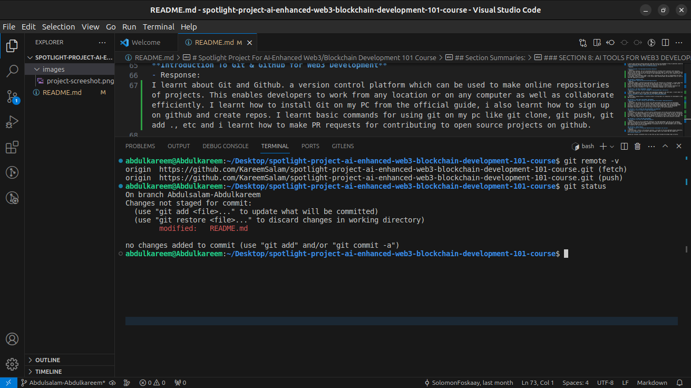

# Spotlight Project For AI-Enhanced Web3/Blockchain Development 101 Course

Welcome to the Spotlight Project for the AI-Enhanced Web3/Blockchain Development 101 Course at dProgramming University. Follow the instructions below to complete your project submission.

## Project Instructions:

1. Star and fork this repository.
2. Clone your forked repository to your local machine.
3. Create and switch to a new branch named after your certificate name.
4. Answer the questions provided in each section summary.
5. Take a screenshot of your terminal after running `git remote -v` and `git status`.
6. Push your changes and open a pull request to merge your branch into the main branch of this repository.

## Section Summaries:

### SECTION 1: THE WEB3 REVOLUTION
**Exploring the Web3 Revolution: The New Decentralized Internet**
- Response: 

I learn about how Web3 envolved from Web1 to Web3 and the decentralization it brought. I also learnt about the trending shift in web applications from Web 2 to Web 3. 

**Unlocking the Potential of Blockchain Technology**
- Response: 

In this lesson, I learnt alot about Blockchain technology like nodes, validator, consensor to prepare me as a Blockchain developer. I also learnt about Blockchain Consensus mechanisms like Proof of work(PoW) and proof of stake(PoS).

### SECTION 2: SMART CONTRACTS UNVEILED
**Smart Contracts Explained: The Building Blocks of Web3**
- Response: 
I learnt about smart contracts which are self executing contracts/agreements directly written into code. I also learnt about  Smart contract Programming languages like solidity, rust, etc as well as some of the top smart contract blockchains like Ethereum, Solana, Binance and a few more.

### SECTION 3: DIVE INTO BLOCKCHAIN PLATFORMS
**Bitcoin Blockchain: The Origin and Evolution of the First Cryptocurrency**
- Response: 
I learnt about bitcoin; the first decentralized digital currency developed by Satoshi Nakomoto. I also learnt about bitcoins transaction model; the Unspent Transaction Output (UTXO) which tracks transation outputs and maintains transparency in Bitcoin's Ledger. 
I learnt about bitcoins hashing Algorithm (SHA 256) and how the byte256bit string it generates cannot be reverse engineered thereby, making transactions even all the more secure.  
**Ethereum Ecosystem: A Deep Dive into EVM Blockchains**
- Response: 

**Solana Ecosystem: The High-Speed Blockchain Network**
- Response: 
I learnt about Ethereum, the first Blockchain Network to introduce smart contracts (self executing contracts with the terms of the contract directly written into code). I learnt about its founder Vitalik Buterin and how his idea which was launched in 2015 spearheaded the idea of not just cryptocurrency, but a decentralized internet.
I also learnt about Ethereum's layer 1 and layer 2 solutions as well as how it transitioned from Proof of work(PoW) to Proof of Stake(PoS). I also learnt about ethereum Nodes and Development tools as well as some EVM compatible blockchains.

### SECTION 4: DECODING DAPPS
**dApps Decoded: Unpacking Decentralized Applications**
- Response: 
I leart about dApps; a decentralized application that runs typically on a blockchain. I learnt about the differences between dApps and traditional web applications, a few of which include; its open source nature, its decentralized hosting, as well as distributed control, to mention a few.
I also learnt about the basic architecture of a dApp which consists of the frontend, Middleware and backend. i was also introduced to a few of the programming languages used to develop each. 

### SECTION 5: TOP WEB3 PROGRAMMING LANGUAGES
**Vanilla Solidity: Smart Contract Language of Ethereum/EVM Smart Contracts**
- Response: 
I learnt about solidity, the most widely used programming language in the web3 space. I learnt about its history, challenges as well as some tools for development like Remix IDE. 
**Solang Solidity for Solana: Adapting Solidity for Non-EVM Blockchains**
- Response: 
I learnt about solang solidity, a solidity project to bring about its integration for development in Non EVM blockchains.

### SECTION 6: SETUP WEB3 DEVELOPMENT ENVIRONMENT
**Web3 Developer Toolbox: Setting up Web3 Development Environment (Ethereum/Solana)**
- Response: 
I learnt about the starter kit for diving into web3 development and how to setup mhy development environment. I learnt that using Linux Os, MacOs or WSL would be more efficient in my development journey. I also learnt how to set up tools like Node version manager(NVM), Node Package Manager(NPM) blockchain CLI tools, etc. I also learnt how to install Visual Studio Code, an IDE (Integrated Development Environment) which i will be using to write code as the course progresses.

### SECTION 7: GIT & GITHUB FOR WEB3 DEVELOPMENT COLLABORATION
**Introduction To Git & GitHub for Web3 Development**
- Response: 
I learnt about Git and Github. a version control platform which can be used to make online repositories of projects. This enables developers to work from any location or on any computer as well as collaborate efficiently. I learnt how to install Git on my PC from the official guide, i also learnt how to sign up on github and create repos. I learnt basic commands for using git on my pc like git clone, git push, git add ., etc and i learnt how to make PR requests for contributing to open source projects on github. 

### SECTION 8: AI TOOLS FOR WEB3 DEVELOPMENT
**Introduction To AI Tools For Web3 Development**
- Response: 
I learnt about how AI can be integrated seamlessly into web3 development, and how it can increase a developer's productivity massively. I learnt about a few AI options for web3 devlopment like chatGpt, Bard, Github Copilot as well as dPUWeb3DevGpt a customized AI tool for web3 developers built on chatgpt and created by the course instructor.

### SECTION 9: COURSE PROJECT
**Spotlight Project For AI-Enhanced Web3/Blockchain Development 101 Course**
- Response: 
I practiced what i learnt in the previous sections. i was able to fork the spotlight project repository, clone to my local pc, edit on my branch, add my changes, push to my forked repo and request PR.
## Screenshot Submission:

Upload your terminal screenshots here to show that you have followed the GitHub steps correctly.

- 

Make sure the URL of the remote in your screenshot matches the URL of your GitHub repo for this project.

## Conclusion:

Remember, to earn your certificate, you must complete this project satisfactorily. Your submission will be reviewed, and you will receive feedback accordingly. Good luck!

Solomon Foskaay

Founder,

[dProgramming University](https://dProgrammingUniversity.com)

